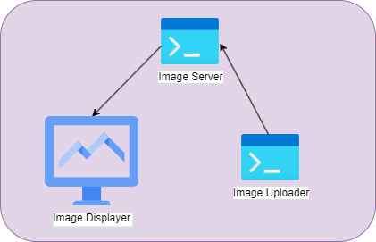
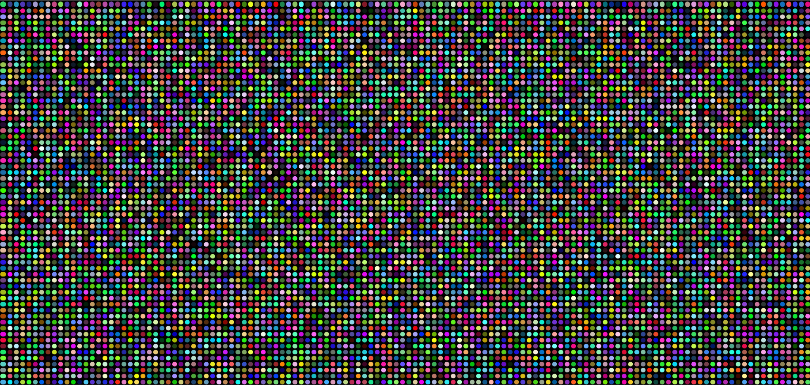

This is a simple LED matrix simulator that I use for holiday displays.

# Components
## Image Server
Image server that sends out images to consuming clients every second.  Also allows the upload of new images.

`npm run server`

## Image View Client
This is a simple p5 canvas that displays the "pixels" on the matrix display.

`npm start`

## Image Uploader Util Client
This utility client will upload files in the images folder on a ten second rotation.

`npm run upload`

# Example
Here is an example of a 128x64 display set to random colors.

